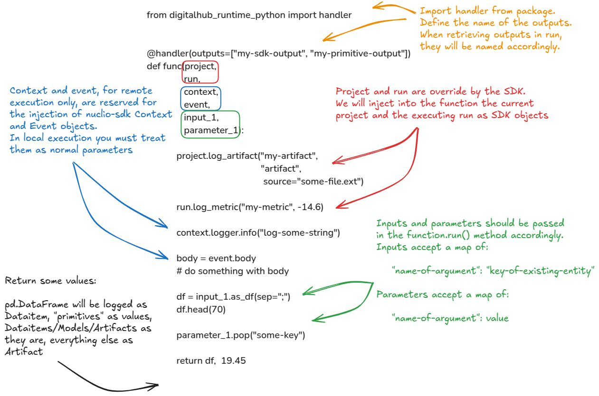

# Define a python function

You can declare a generic python function as usual with the `def` keyword.

## Anatomy of a function



A python function can be defined as follows:

```python
from digitalhub_runtime_python import handler


@handler(outputs=["my-sdk-output", "my-primitive-output"])
def func(project,
         run,
         context,
         event,
         input_1,
         parameter_1):

    project.log_artifact("my-artifact",
                            "artifact",
                            source="some-file.ext")

    run.log_metric("my-metric", -14.6)

    context.logger.info("log-some-string")

    body = event.body
    # do something with body

    df = input_1.as_df(sep=";")
    df.head(70)

    parameter_1.pop("some-key")

    return df,  19.45
```

It is not mandatory to provide any arguments or return values. The following function is also permitted:

```python
def func():
    print("hello world")
```

The defined function will be the entrypoint of your code when it is specified as `handler` in the run execution parameters.

With the python runtime, comes a set of tools and utilities to handle inputs and outputs of a function and also manage platform objects.
Here follows a list of these utilities:

1. [Reserved arguments](#reserved-arguments) in function signature
2. [Inputs and parameters](#inputs-and-parameters) definition
3. [Handler decorator and outputs](#handler-and-outputs) definition
4. [Init function](#init-function) for remote execution

## Reserved arguments

When you define a function you can declare some arguments. We reserve a small set of `args` for the runtime to use. In particular, we inject at runtime the following arguments:

- `project`: The current context [`Project` object](../../objects/project/entity.md).
- `run`: The current running [`Run` object](../../objects/run/entity.md).
- `context`: The [`nuclio context` object](https://docs.nuclio.io/en/stable/reference/runtimes/python/python-reference.html) (*remote-execution only*).
- `events`: The [`nuclio events` object](https://docs.nuclio.io/en/stable/reference/runtimes/python/python-reference.html) (*remote-execution only*).

!!! Warning "Local execution nuclio context and events objects"
    Note that if you execute your function locally, `context` and `events` **must be** passed as inputs/parameters in `function.run()`.`

## Inputs and parameters

Inputs and parameters are used to pass data to the function. They map the name of a function argument.
The inputs and parameters are mapped to the `inputs` and `parameters` arguments of the `function.run()` method, and are included in the `Run` object's spec.
Inputs **must be** the key of a `Dataitem`/`Artifact`/`Model` object, while parameters can be any python "primitive" value.

```python
# Example with a dataitem

# Define your function and declare di argument as Dataitem,
# while param1 is a string
def func(di: Dataitem, param1: str):
   # do something
   ...

# First you create/get a dataitem
sdk_dataitem = sdk.new_dataitem(...)

# Reference the di argument as key and the dataitem key as value
sdk_function.run(inputs={"di": sdk_dataitem.key},
                 parameters={"param1": "some value"})
```

!!! Warning "On inputs and parameters distinction"
    Sometimes it is possible to confuse inputs and parameters in `function.run()` method. If you encounter the `Excepition` that tells you that the SDK was unable to parse an `entity_key`, it is possible that you have passed a parameter as an input.

## Handler and outputs

A function can be decorated with the `@handler` decorator from the `digitalhub_runtime_python` package.
The decorator is used to map the outputs of the function in the `outputs` and `results` attributes of the `Run` object.

```python
from digitalhub_runtime_python import handler

@handler(outputs=["data", "string"])
def func(di: Dataitem, param1: str):
   # do something with di
   return pd.DataFrame, "some value"


run = sdk_function.run(inputs={"di": sdk_dataitem.key},
                       parameters={"param1": "some value"},
                       ...)


# Wait until it finishes ...

run.output("data") # Here you get a Dataitem object
run.result("string") # Here you get a string "some value"
```

!!! info "Decoration"
    You may or may not decorate your function with the `@handler` decorator you can import from the `digitalhub_runtime_python` package. If you decorate your function and return something, you need to map the outputs in the decorator to collect named outputs/results, otherwise the SDK will set some placeholder names by default to name the outputs.

## Init function

The `init function` is a function executed by the nuclio wrapper (in remote execution) before the effective execution of the user handler.
A small difference relative to the user defined function handling, is that we override only the `context` argument at runtime by injecting the `nuclio context` object as function parameter. The `init function` can accept some parameters, but it is not mandatory. The parameters are passed by the user at runtime into runs through the `init_parameters` parameter in `function.run()`.

```python
def init(context, param1, param2):
    ...


run = sdk_function.run(...,
                       init_parameters={"param1": "some value",
                                        "param2": "some value"})
```

You can now check the arguments required to [create](3-entities.md) a `Function` object and launch a new run.
