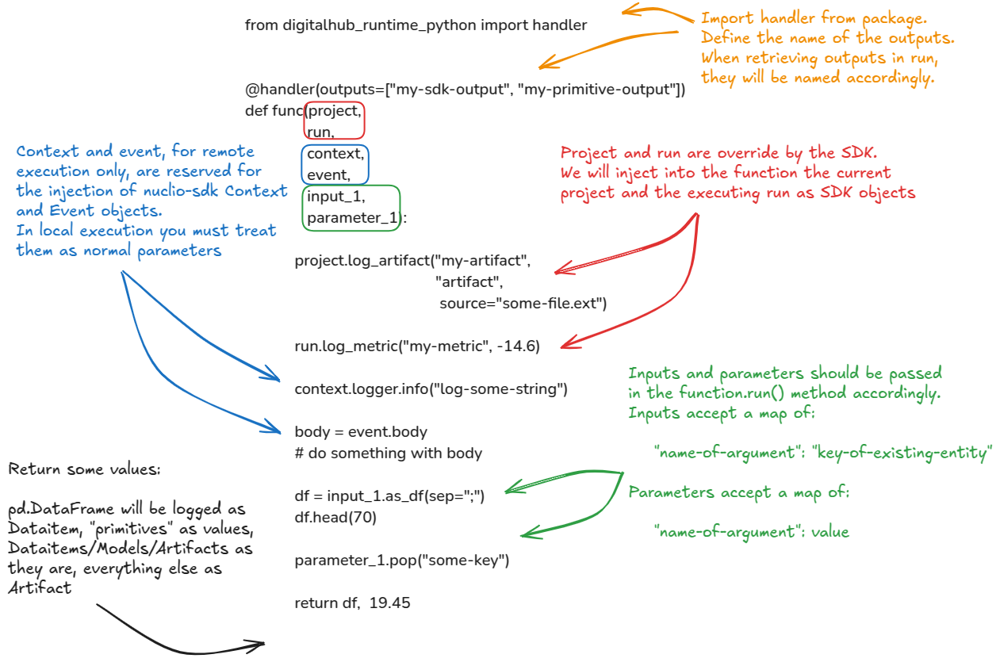

# Define a Open Infeference v2 Function

This section describes how to define a openinference-runtime handler. A handler is a Python function declared with the standard `def` keyword. The runtime injects reserved arguments and provides helpers to map inputs and outputs. See the [Open Inference Protocol](https://github.com/open-inference/open-inference-protocol) for more details.

## Function Anatomy



**Example handler:**

```python
from digitalhub_runtime_python import handler

def func(project, run, context, event, request):
    run.log_metric("my-metric", -14.6)
    image_bytes = request.inputs[0].data

    return {
        "outputs":
            [
                {"name": "caption", "datatype": "BYTES", "data": [caption], "shape": [1, len(caption)]}
            ]

    }
```

The function you define becomes the entrypoint when referenced as the `handler` in the run configuration.

## Reserved arguments

The runtime injects a small set of reserved arguments when it invokes your handler. Commonly injected values are:

- `project` — the current [`Project` object](../../../objects/project/entity.md).
- `run` — the active [`Run` object](../../../objects/run/entity.md).
- `context` — the Nuclio runtime context object (see Nuclio Python runtime docs) — only available in remote execution.
- `event` — the Nuclio event object — only available in remote execution.
- `request` - A body of the OpenInference InferRequest object with the corresponding fields.

## Init function

When executing remotely, the Nuclio wrapper calls an `init` function (if present) before invoking your handler. The runtime injects the Nuclio `context` into `init` at invocation time. Additional parameters may be supplied via `init_parameters` in `function.run()`.

```python
def init(context, param1, param2):
    # initialization logic
    ...


run = sdk_function.run(...,
                       init_parameters={"param1": "some value",
                                        "param2": "some value"})
```
